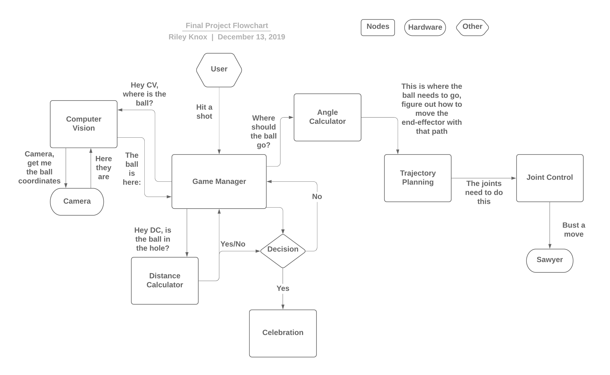

# Mini Golf

*Shangzhou Ye, Joshua Cohen, Yigitcan Comlek and Riley Knox*

## Demo

<p align="center">
  
</p>

For a video of the robot in action, [please watch this video](https://www.youtube.com/watch?v=8vYBKLIraps).

## Overview

The goal of this project was to program a Rethink Sawyer robot to play mini-golf. Given a game space mimicking a putting green, the robot recognizes the ball and the hole, and moves itself into a striking position behind the ball. Then, it actuates its joints to perform a putting motion and hit the ball into the hole. 

This repository is our final project of ME495: Embedded Systems in Robotics (ROS), Dec. 2019. The theme is recreational robotics.

## Project Overview

### Operation
Once installed, this package can be operated using two simple commands. To launch all the nodes and prepare to hit, enter in the command line:

```
roslaunch mini_golf launch.launch
```

The robot will then wait for the command to hit the ball. This command is a service that can be called by entering:

```
rosservice call /game_on
```

### Nodes

This project is designed as an interaction of five nodes:

- cv_detect_ball: computer vision; visualizes the game space and finds the ball & hole
- move_group_python_interface: trajectory planning; determines the end-effector motion necessary to a) move the putter behind the ball and b) hit the ball towards the hole
- hit_ball: actuation; plans and sends commands to the joints to move the robot per the planned trajectory
- game_planner: integrator node; brings information from the other four nodes together to achieve the task
- camera_cal2: calibrates the camera space to the physical game space

The function of these nodes will be described in detail later. However, the program generally follows the structure of the flowchart shown here:



### Physical Equipment:

* Acrylic game board (2' x 4') with holes
* Artificial turf putting surface: 8 (1' x 1') pieces
* Golf ball
* 3D printed putter
* Rethink Robotics Sawyer robot
* External USB camera

### Third Party Packages:

* Sawyer_tools
* Sawyer_gazebo
* Sawyer_moveit
* Sawyer_robot
* MoveIt
* OpenCV

### Node Descriptions:

#### Computer Vision
- Objective
    - Design and program a Sawyer camera interface that accurately recognizes the game space, including the ball, hole, and the game area itself, and to package and distribute that information in a way that allows other program components to successfully interact with the game space.
- Successes
    - The camera consistently and effectively identified the ball and the game space using color-based image segmentation.
    - The computer vision node converts the pixel locations of the ball to geometric coordinates based off a set of physical calibration parameters.
- Failures
    - We ended up using an external camera to identify the game area, as the Sawyer camera was not sufficient for our needs. Color detection was not ideal and the camera was somewhat fish-eyed, which would have negatively impacted our calculations of distance/angle to the ball and hole.
    - We would have liked to perform camera calibration automatically, rather than having to physically move the ball around and calibrate our game space based on those measurements; however, automatic calibration proved inconsistent.
- Future Improvements
    - Work on automatic camera calibration.

#### Mapping Frames

- Objective
    - Provide setup calibration procedure for translating overhead camera picture coordinates to real world Sawyer frame coordinates.
    - Provide a service to the game planner that could convert overhead camera picture coordinates to real world Sawyer frame coordinates.
- Successes
    - Established a calibration system and position translation service.
- Failures
    - Resolution of service was ~4cm in addition to calibration being a rather long process, taking ~15 minutes.
- Future Improvements
    - Successfully implement solvePnP mapping with OpenCV and the provided checkerboard, then using homography to map between the overhead camera frame and Sawyer frame.
    - Using April tags such that the overhead frame and Sawyer could locate themselves in space using the transforms provided by perceiving the April tags. This is likely the optimal approach.

#### Moving Behind Ball

- Objective
    - Move the putter behind the ball to prepare for hitting. The putter should be positioned behind the ball, collinear with the ball and hole, and facing towards the hole.
    - Obstacle avoidance: the putter should not collide with the table, ball, or robot.
- Successes
    - Configured MoveIt to work with sawyer; forked moveit_sawyer package for the specific use of this project, and modified joint velocity limits and scaling according to our requirements.
    - Completed position and angle calculation using the position of the ball and hole obtained from the CV node.
    - Implemented collision avoidance by adding the table, putter, and ball to the motion planning scene. Removed the self-collision check between the putter and the gripper.
    - Enhanced the capability to reliably find solutions with inverse kinematics and obstacle avoidance motion planning by requesting the numerical solution multiple times.
- Failures
    - Attempted to align Joint 5 with the hitting direction by adding an extra constraint to the motion planner. It turns out that with seven constraints (including six components of the requested pose) and joint limits of the robot, a solution cannot always be found.
- Future Improvements
    - The distance behind the ball can be automatically calculated according to the distance between the ball and hole.

#### Hitting Ball

- Objective
    - Hit the ball towards the hole using a motion similar to an actual golf swing.
    - Align the putter with the direction to the hole right before hitting the ball.
    - Use MoveIt to accomplish this task.
- Successes
    - Based on the ball's location, completed the putting motion to hit it to the hole successfully.
    - Made the putting motion similar to a real golf swing.
    - Returned to the home location after each swing to wait for the next shot.
- Failures
    - Attempted to use velocity control to hit the ball. Our first attempts at velocity control resulted in pushing the ball along the line to the hole, rather than a swing that contacts the ball at a single time point.
    - Did not always successfully align the putter in the same direction as the hole right before the hit, causing the ball to not move directly towards the hole.
- Future Improvements
    - Velocity control can be implemented to see if it is possible to hit the ball without checking which area the ball is in.
    - The putter can be aligned perfectly right before the hit.

### Role Breakdown
* Josh </br>
Mechanical - Assist in prototyping </br>
Integration - Create services to communicate between nodes and build control interface </br> </br>
* Yigitcan </br>
Operation of joints - Make the joints move according to the trajectory that is planned </br></br>
* Shangzhou </br>
Distance/angle calculation - Calculate the distance and the angles to the hole according to the location of the ball </br>
Motion planning in task space - Plan a path according to the location of the ball in the task space </br> </br>
* Riley </br>
Mechanical - Design of putter/game space; fabrication of game space </br>
Computer Vision - Identification of ball, hole, and game space
